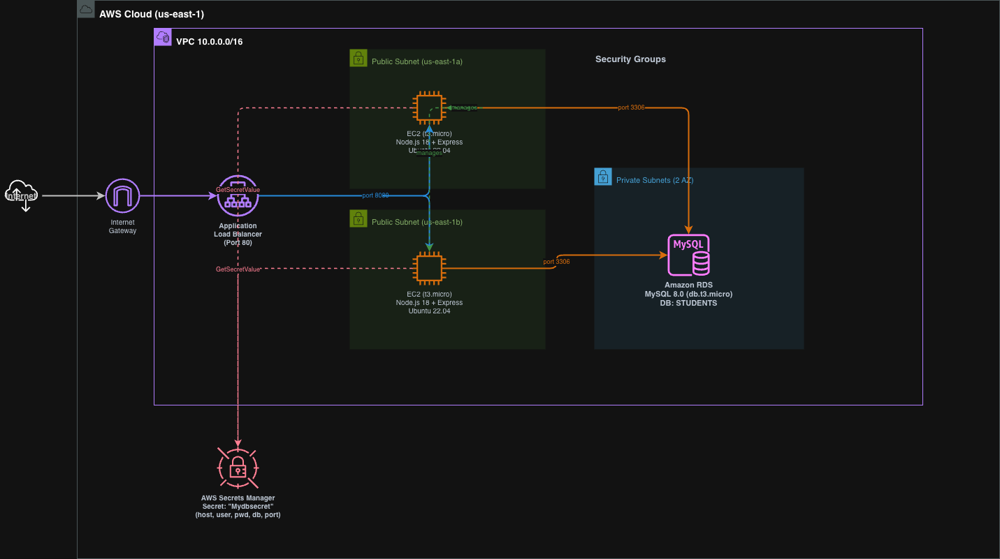
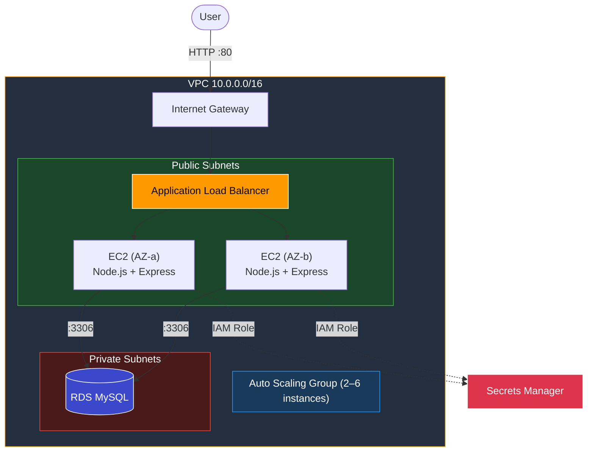

[](https://github.com/salim-lakhal/aws-vpc-crud-webapp/actions/workflows/ci.yml)

# AWS VPC CRUD Web Application

A student records management app (CRUD) deployed on AWS with a production-grade cloud architecture: custom VPC with public/private subnets, EC2 behind an Application Load Balancer with Auto Scaling, RDS MySQL in an isolated private subnet, and secrets managed through AWS Secrets Manager.

Built incrementally across 4 phases — from a single-instance POC to a highly available, auto-scaling deployment across multiple Availability Zones.



## Architecture



## How It Works

1. Users hit the ALB's public DNS on port 80
2. The ALB distributes traffic across EC2 instances in two Availability Zones
3. Each EC2 instance runs a Node.js/Express server that fetches DB credentials from **AWS Secrets Manager** at startup (no hardcoded passwords)
4. The app connects to **RDS MySQL** in a private subnet — the database has no internet access
5. Auto Scaling adjusts the fleet between 2–6 instances based on CPU utilization (target: 50%)

## Project Phases

| Phase | What | Key Change |
|-------|------|------------|
| **1** | Network setup | VPC, public/private subnets, Internet Gateway, route tables |
| **2** | Single-instance POC | EC2 with Node.js + MySQL on the same machine, credentials hardcoded |
| **3** | Decouple DB | RDS MySQL in private subnet, credentials moved to Secrets Manager + IAM Role |
| **4** | High availability | ALB + Auto Scaling Group across 2 AZs, systemd service, load testing |

## Tech Stack

| Component | Technology |
|-----------|-----------|
| Runtime | Node.js + Express |
| Templates | EJS |
| Database | MySQL (Amazon RDS) |
| Secrets | AWS Secrets Manager + IAM Role |
| Networking | VPC, Subnets, Internet Gateway, Security Groups |
| Load Balancing | Application Load Balancer |
| Scaling | EC2 Auto Scaling (target tracking) |
| Deployment | EC2 User Data + systemd |

## Repository Structure

```
code/
  phase2/              # POC — local MySQL, hardcoded credentials
    app.js             # Express server
    setup-db.sql       # Database initialization
    views/             # EJS templates (index, add, edit)
  phase3-4/            # Production — RDS + Secrets Manager
    app.js             # Express server with AWS SDK
    student-app.service# systemd unit file for auto-restart
    views/             # EJS templates
scripts/
  poc-userdata.sh              # EC2 User Data for Phase 2
  appserver-userdata.sh        # EC2 User Data for Phase 3/4
  phase4-ha-autoscaling.sh     # ALB + ASG setup reference script
docs/
  architecture-finale.png      # Architecture diagram
```

## Security Design

- **Network isolation**: RDS sits in a private subnet with no route to the internet
- **Security Group chaining**: Internet → ALB SG (port 80) → EC2 SG (port 80) → DB SG (port 3306). Each SG only allows traffic from the previous one
- **No hardcoded secrets**: Phase 3+ uses Secrets Manager with IAM Role-based access — the EC2 instance profile grants read access to the secret at runtime
- **Least privilege SSH**: Port 22 restricted to operator IP only

## Deployment

### Phase 2 (POC)

1. Create a VPC with `10.0.0.0/16` CIDR, one public subnet, one private subnet
2. Attach an Internet Gateway and configure route tables
3. Launch an EC2 instance (t2.micro, Ubuntu) in the public subnet
4. Use `scripts/poc-userdata.sh` as User Data — it installs everything and starts the app on port 80

### Phase 3-4 (Production)

1. Create an RDS MySQL instance in the private subnet
2. Store DB credentials in Secrets Manager (secret name: `Mydbsecret`)
3. Create an IAM Role with `secretsmanager:GetSecretValue` and attach it to EC2
4. Configure Security Groups: DB SG allows port 3306 only from the EC2 SG
5. Use `scripts/appserver-userdata.sh` as User Data for the EC2 instance
6. Set up ALB + Auto Scaling using `scripts/phase4-ha-autoscaling.sh` as reference

## AWS Services Used

| Service | Purpose |
|---------|---------|
| **VPC** | Isolated network with public/private subnet separation |
| **EC2** | Application servers running Node.js |
| **RDS** | Managed MySQL database in a private subnet |
| **ALB** | Distributes HTTP traffic across instances in 2 AZs |
| **Auto Scaling** | Maintains 2–6 instances based on CPU load |
| **Secrets Manager** | Securely stores and rotates DB credentials |
| **IAM** | Role-based access for EC2 to read secrets |
| **CloudWatch** | Metrics and alarms for scaling decisions |

## License

[MIT](LICENSE)
